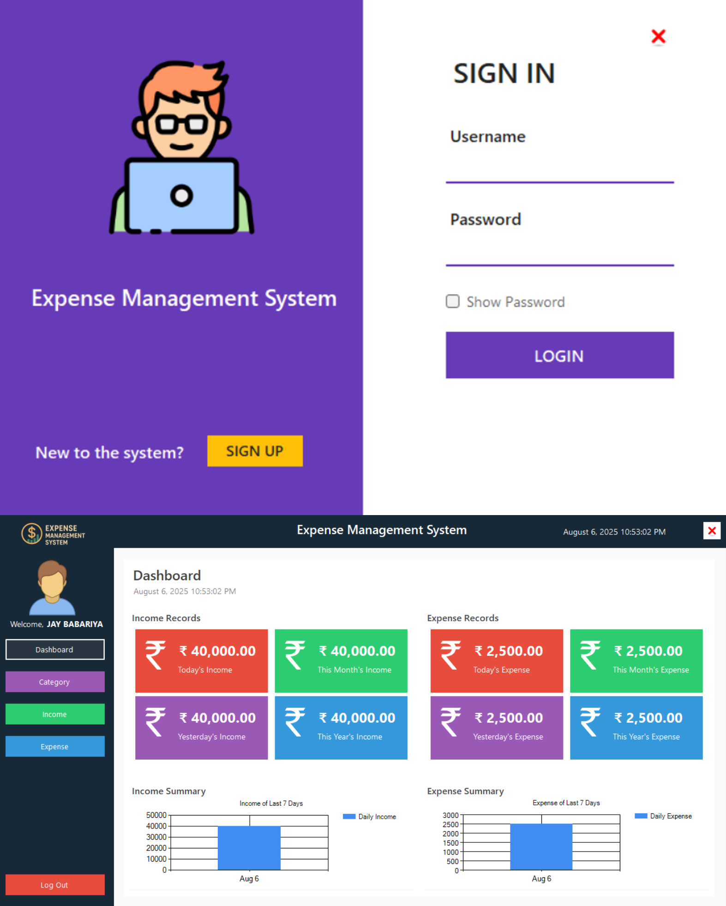

````
# 💰 Expense Management System



A **modern Windows desktop application** built with **C# (.NET Framework)** and **SQL Server** for managing personal incomes and expenses.  
Includes **authentication**, **category-based tracking**, and a **dashboard with live analytics** to help users stay on top of their finances.

---

## ✨ Features

- **User Authentication** – Login & register with secure validation.
- **Interactive Dashboard** – Real-time analytics with income & expense summaries.
- **Category Management** – Create and organize categories for better tracking.
- **Income & Expense Records** – Add, view, and track transactions with descriptions.
- **Dynamic UI** – Side-panel navigation with modular forms.
- **Live Date & Time** – Real-time clock displayed on the dashboard.
- **Secure Logout & Exit** – Ensures data safety and session handling.

---

## 🛠️ Tech Stack

- **Frontend:** Windows Forms (C#), GDI+ for UI design
- **Backend:** .NET Framework  
- **Database:** SQL Server (Hosted on GearHost)  
- **Libraries:**  
  - `System.Data.SqlClient` – SQL Server connectivity  
  - `MySql.Data.MySqlClient` – Prepared for MySQL support  

---

## 📂 Project Structure

- **Forms:**  
  - `LoginForm` – User login screen  
  - `RegisterForm` – New user registration  
  - `DashboardForm` – Main navigation hub  
- **User Controls:**  
  - `UCDashboardForm` – Analytics and summaries  
  - `UCCategoryForm` – Manage categories  
  - `UCIncomeForm` – Manage incomes  
  - `UCExpenseForm` – Manage expenses  
- **Data Access Classes:**  
  - `CategoryData.cs` – Category operations  
  - `ExpenseData.cs` – Expense operations  
  - `IncomeData.cs` – Income operations  

---

## 🗄️ Database

The application uses **SQL Server** with this connection string:

```csharp
Server=den1.mssql7.gear.host;
Database=sql12793698;
User Id=sql12793698;
Password=Wd8ij_D1V2h~;
TrustServerCertificate=True;
````

**Tables:**

* `tbl_users` – Stores login credentials
* `tbl_category` – Stores categories
* `tbl_expense` – Stores expense records
* `tbl_income` – Stores income records

---

## 🚀 How to Run

1. **Clone the Repository**

   ```bash
   git clone https://github.com/jaybabariya1612/Expense-Management-System.git
   ```
2. **Open in Visual Studio**

   * Open `ExpenseManagementSystem.sln`
3. **Update Connection String (Optional)**

   * Modify it in `CategoryData.cs`, `ExpenseData.cs`, `IncomeData.cs` if using your own database.
4. **Build & Run**

   * Press **F5** or click **Start** in Visual Studio.
5. **Login or Register**

   * Create a new account using the Register form.

---

## 📸 Screenshots

### Login Screen


### Dashboard

*View incomes, expenses, and live analytics with a modern interface.*

---

## 🔮 Future Enhancements

* **Report Generation** – Monthly/Yearly summaries
* **Export Options** – Export data to Excel/PDF
* **Role-based Access** – Admin/User roles
* **Cross-Platform Version** – Using .NET MAUI or WPF

---

## 👨‍💻 Author

**Jay Babariya**
*Bachelor of Computer Applications (BCA)*
[Portfolio](#) | [LinkedIn](#) | [GitHub](https://github.com/jaybabariya1612)

---

## 📜 License

This project is licensed under the **MIT License**.
You are free to use and modify it with attribution.

````

---

### Next steps for you:
1. **Place the combined screenshot** (`Combined_ExpenseApp.png`) in your project root (same folder as README).  
2. **Commit & push:**
   ```bash
   git add .
   git commit -m "Added README and screenshot"
   git push origin main
````


Which one should I prepare next?
